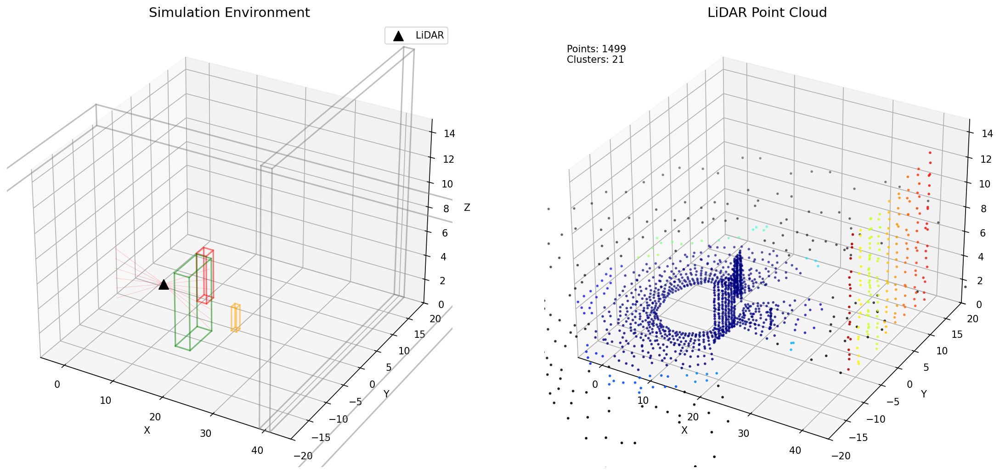
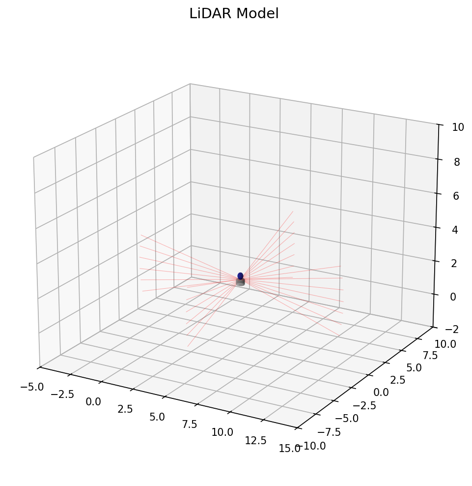
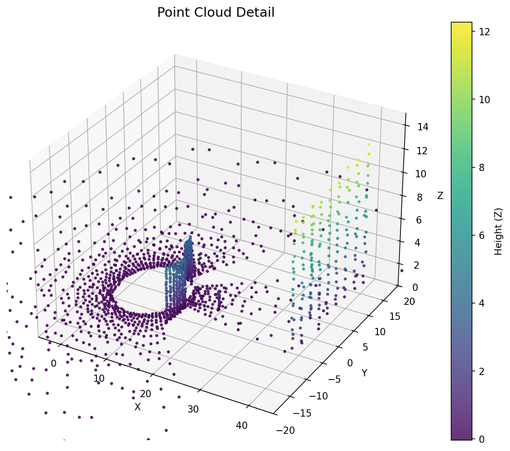
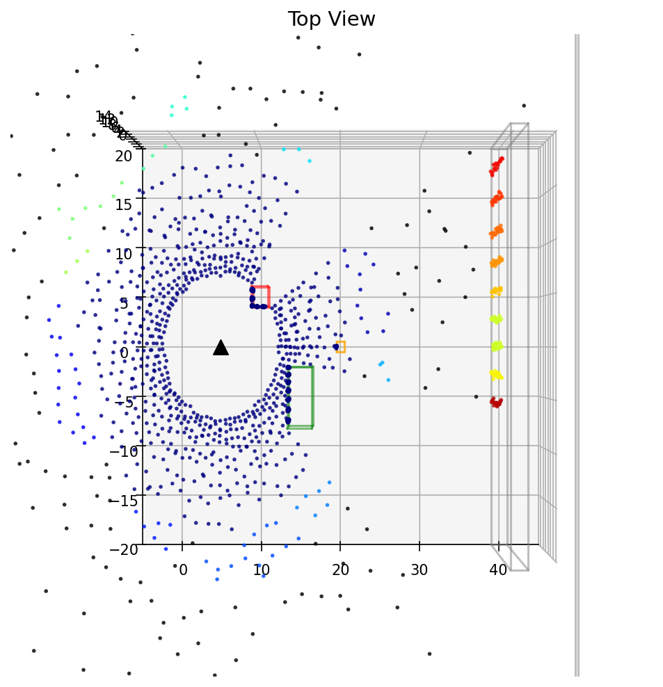
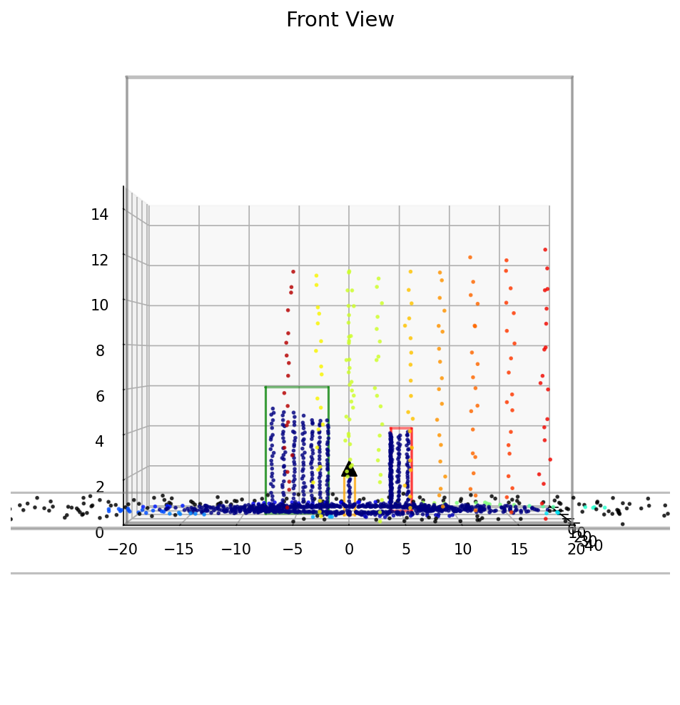
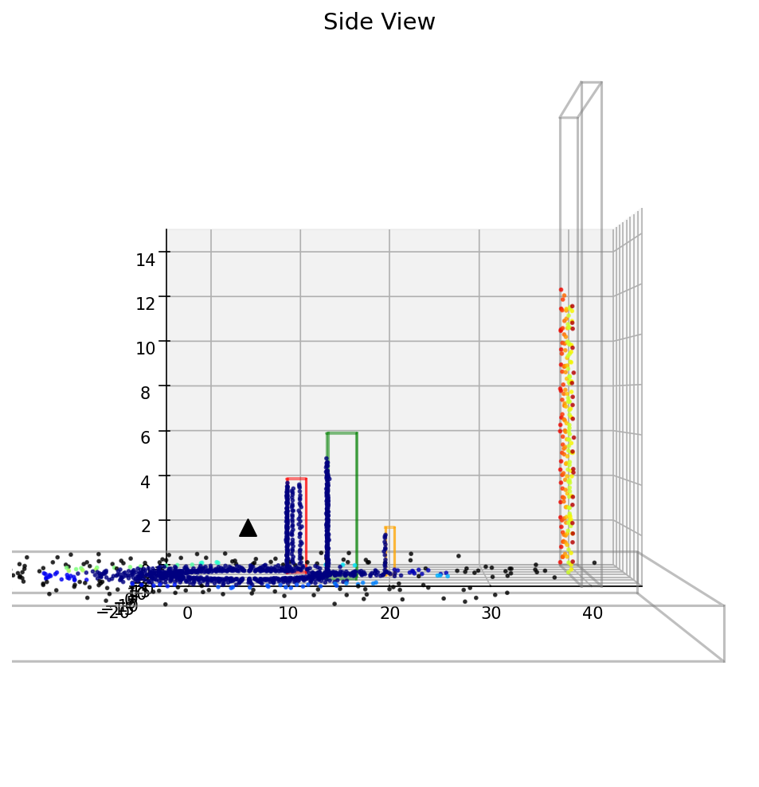
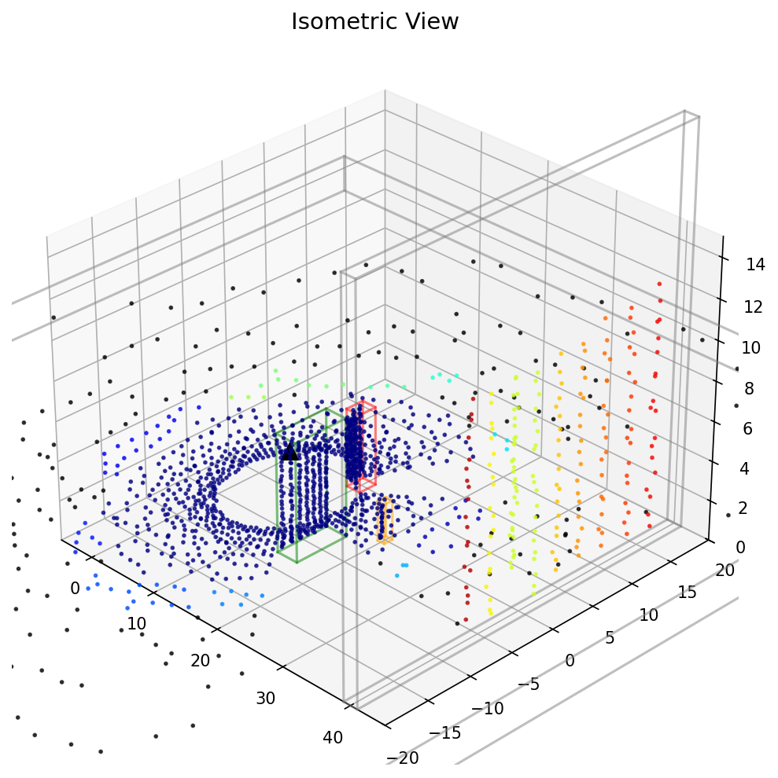

# LiDAR 点云仿真演示系统

## 效果展示

### 主界面



*系统主界面：左侧为仿真环境视图，右侧为点云数据视图*

### LiDAR 传感器模型



*LiDAR 传感器模型及扫描射线分布*

### 点云详情



*点云数据按高度着色显示*

### 多视角展示

| 俯视图 | 正视图 |
|:------:|:------:|
|  |  |

| 侧视图 | 等轴视图 |
|:------:|:-------:|
|  |  |

---

## 项目简介

本系统为计算机视觉、机器人感知和自动驾驶方向学生设计的 LiDAR 仿真入门课程，通过多种技术实现帮助学生理解 LiDAR 点云生成原理。

### 课程目标

完成本课程后，学生应能够：

1. **知识层面**
   - 理解射线投射（Ray Casting）算法原理
   - 掌握 AABB 碰撞检测（Slab 方法）
   - 了解点云聚类（DBSCAN）基础

2. **技能层面**
   - 能够运行和操作多种仿真程序
   - 能够调整参数并分析对点云的影响
   - 能够阅读和修改 Python 仿真代码

3. **应用层面**
   - 理解 LiDAR 仿真在自动驾驶开发中的应用
   - 了解不同可视化技术的优缺点

---

## 版本说明

| 版本 | 文件 | 渲染引擎 | 交互方式 | 性能 | 适用场景 |
|------|------|---------|---------|------|---------|
| 基础版 | `lidar_simulation.py` | Matplotlib | 自动移动 | 低 | 教学、演示 |
| 交互版 | `lidar_simulation_interactive.py` | Matplotlib | 键盘控制 | 低 | 教学、调试 |
| Open3D版 | `lidar_simulation_open3d.py` | Open3D GUI | 键盘控制 | 高 | 高性能仿真 |
| 双窗口版 | `lidar_simulation_dual.py` | Open3D | 键盘控制 | 高 | 多视图展示 |

---

## 快速开始

### 环境要求

| 软件 | 版本 | 安装命令 |
|------|------|---------|
| Python | 3.8+ | conda 或官网下载 |
| NumPy | 1.21+ | `pip install numpy` |
| Matplotlib | 3.5+ | `pip install matplotlib` |
| scikit-learn | 1.0+ | `pip install scikit-learn` (可选) |
| Open3D | 0.17+ | `pip install open3d` (可选) |

### 安装依赖

```bash
# 使用 Conda（推荐）
conda env create -f environment.yml
conda activate lidar_demo

# 或使用 pip
pip install numpy matplotlib scikit-learn open3d
```

### 运行程序

```bash
# 基础版本 - 自动移动演示
python lidar_simulation.py

# 交互版本 - 键盘控制（推荐先尝试）
python lidar_simulation_interactive.py

# Open3D 版本 - 高性能（需要安装 Open3D）
python lidar_simulation_open3d.py

# 双窗口版本
python lidar_simulation_dual.py
```

### 快捷键

| 按键 | 功能 |
|------|------|
| W | 前进（X+） |
| S | 后退（X-） |
| A | 左移（Y+） |
| D | 右移（Y-） |
| Q | 上升（Z+） |
| E | 下降（Z-） |

---

## 项目结构

```
lidar_demo/
├── lidar_simulation.py              # 基础版本
├── lidar_simulation_interactive.py  # 交互版本
├── lidar_simulation_open3d.py       # Open3D 高性能版本
├── lidar_simulation_dual.py         # 双窗口版本
├── lidar_simulation_stable.py       # 稳定版本
├── environment.yml                  # Conda 环境配置
├── capture_screenshots.py           # 截图生成脚本
├── convert_to_html.py               # Markdown 转 HTML 脚本
└── docs/
    ├── images/                      # 程序截图
    └── textbook/                    # 教学文档
        ├── lidar-demo-material.md   # 主教材
        ├── lidar-demo-lab-guide.md  # 实验指导书
        ├── lidar-demo-quick-reference.md  # 快速参考手册
        └── lidar-demo-instructor-guide.md  # 教师手册
```

---

## 核心技术

### 射线投射算法

```python
# 射线定义
P(t) = origin + t * direction

# 对于每条射线：
# 1. 确定射线起点（LiDAR 位置）
# 2. 确定射线方向（基于水平和垂直角度）
# 3. 计算射线与场景中所有物体的交点
# 4. 返回最近的交点作为测量结果
```

### AABB 碰撞检测（Slab 方法）

```python
def intersect(ray_origin, ray_dir, min_bound, max_bound):
    inv_dir = 1.0 / (ray_dir + 1e-9)  # 避免除零
    t1 = (min_bound - ray_origin) * inv_dir
    t2 = (max_bound - ray_origin) * inv_dir
    tmin = np.maximum(np.minimum(t1, t2), 0.0)
    tmax = np.minimum(np.maximum(t1, t2), 1e9)
    t_enter = np.max(tmin)
    t_exit = np.min(tmax)
    return t_enter if t_exit >= t_enter else np.inf
```

### DBSCAN 点云聚类

```python
from sklearn.cluster import DBSCAN

def cluster_points(points, eps=2.0, min_samples=3):
    clustering = DBSCAN(eps=eps, min_samples=min_samples).fit(points)
    return clustering.labels_
```

---

## 教学资源

| 文档 | 说明 |
|------|------|
| [主教材](docs/textbook/lidar-demo-material.md) | 完整的教学内容，包含原理讲解和代码解析 |
| [实验指导书](docs/textbook/lidar-demo-lab-guide.md) | 6 个实验的详细步骤和数据记录表 |
| [快速参考手册](docs/textbook/lidar-demo-quick-reference.md) | 核心概念、公式和代码片段速查 |
| [教师手册](docs/textbook/lidar-demo-instructor-guide.md) | 教学要点、常见问题解答和评分标准 |

### 建议课时安排

| 章节 | 内容 | 建议课时 | 教学方式 |
|------|------|---------|---------|
| 第一章 | 教学概述 | 0.5 课时 | 讲授 |
| 第二章 | LiDAR 仿真原理 | 2 课时 | 讲授+演示 |
| 第三章 | 系统架构与设计 | 1.5 课时 | 讲授 |
| 第四章 | 核心代码解析 | 2 课时 | 讲授+实操 |
| 第五章 | 版本详解 | 1 课时 | 演示 |
| 第六章 | 实验指导 | 4 课时 | 实验课 |
| **合计** | | **11 课时** | |

---

## 扩展资源

### 推荐阅读

- **射线追踪**: 《Ray Tracing in One Weekend》
- **点云处理**: [Open3D 文档](http://www.open3d.org/)
- **聚类算法**: scikit-learn DBSCAN 文档

### 进阶学习路径

1. **点云处理**: 点云滤波、配准（ICP）、分割
2. **SLAM 技术**: LiDAR SLAM、Cartographer、LOAM
3. **深度学习**: PointNet、PointPillars、3D 目标检测

---

## 常见问题

| 问题 | 解决方案 |
|------|---------|
| `No module named 'numpy'` | `pip install numpy` |
| `No module named 'sklearn'` | `pip install scikit-learn` |
| Open3D 窗口无法显示 | 更新显卡驱动，确保支持 OpenGL |
| 程序卡顿 | 降低 `res_v` 和 `res_h` 参数 |
| 点云聚类全是 -1 | 增大 eps 参数或增加扫描分辨率 |

---

## 许可证

MIT License

---

*本项目：LiDAR 点云仿真演示系统*

*最后更新：2026年2月*
